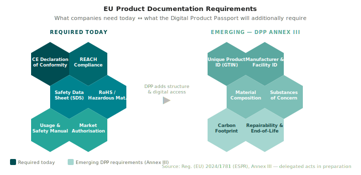
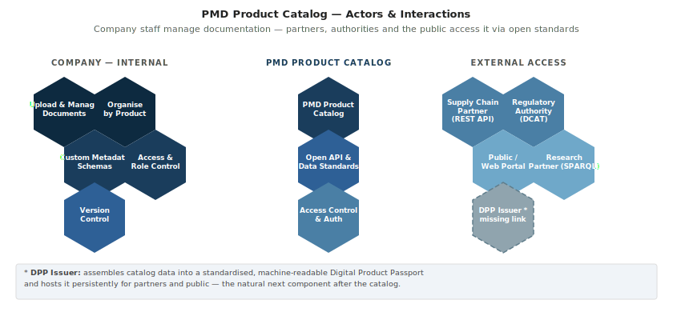
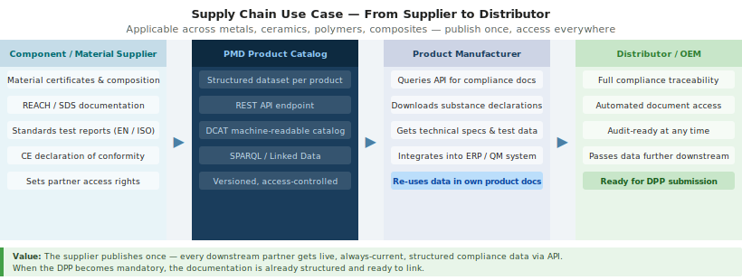

# Digital Product Passport — Preparing Today with the PMD Product Catalog

The EU Digital Product Passport (DPP) is coming — but when exactly, and in what form, remains in flux. The Ecodesign for Sustainable Products Regulation (ESPR, Reg. (EU) 2024/1781) is now in force and defines the framework, but product-specific requirements are still being worked out through delegated acts. This uncertainty is not a reason to wait. The information a DPP will require is largely documentation that companies trading in the EU already need. The question is not whether to collect it — but whether it is structured, accessible, and machine-readable. The PMD Product Catalog helps companies get there now.

---

## 1. The EU Digital Product Passport — Current Status

The ESPR entered into force in July 2024, replacing the Ecodesign Directive. It establishes a framework for Digital Product Passports across virtually all product categories sold in the EU — from metals and ceramics to textiles, electronics, and construction materials. Annex III of the regulation defines the baseline data requirements: every product must be uniquely identifiable (via GTIN or equivalent), the manufacturer and production facility must be registered, and information on material composition, substances of concern, carbon footprint, repairability, and end-of-life handling must be accessible via a digital data carrier such as a QR code. Product-specific delegated acts will define the exact data fields per product group. These acts are in preparation; the first wave is expected to target textiles, furniture, iron and steel, aluminium, and energy-related products.

The left column of the diagram shows documentation companies already need today to legally trade in the EU — CE declarations, REACH compliance, safety data sheets, usage manuals. The right column shows the structured, digitally accessible layer that the DPP introduces on top: standardised identifiers, machine-readable substance declarations, carbon footprint data, and repairability information. The data itself is largely not new. The required format and accessibility is.

---

## 2. Why Prepare Now

Several product-specific DPP specifications — most notably the Battery Passport — are already being piloted or implemented. However, most specifications are still in draft or subject to revision, and the delegated acts that will make them legally binding have not yet been published for most product categories. This creates a window of opportunity: companies that structure their product documentation now will be ready when the rules go live, while those that wait face a last-minute scramble to comply.

Beyond regulatory readiness, there is a practical business case. Supply chains increasingly demand structured, digital product data. Distribution partners, OEMs, and international customers routinely require compliance documentation in machine-readable form. A catalog-based approach provides that capability today — independently of when the DPP mandate takes effect.

The piece that is still missing is a **DPP issuer service**: software that takes structured documentation from a catalog and assembles it into a formally issued, standardised Digital Product Passport, hosted at a persistent URL and linked to a physical product via a data carrier. That component exists in pilots but is not yet widely available as a commercial or open-source solution. The PMD Product Catalog is designed to be the data foundation for exactly this kind of service — structured, API-accessible, and ready to link.

---

## 3. PMD Product Catalog — Features

The PMD Product Catalog is a self-hosted, open-source data management system built on [CKAN](https://ckan.org/), one of the most widely deployed open data portal platforms globally. A company's own staff manage all product documentation directly through a web interface — no external cloud vendor, no dependency on a third-party platform. The catalog runs on the company's own infrastructure or on a dedicated server within the organisation's control.

The diagram shows three groups of actors. On the left, internal staff — quality managers, product engineers, document administrators — upload and maintain product datasets, define custom metadata schemas appropriate to their product types, and control who can see what. In the centre, the catalog itself provides the technical backbone: a structured dataset store, open API, machine-readable catalog endpoint, and semantic web layer. On the right, external actors access the catalog through standardised interfaces — no custom integrations required. Supply chain partners query the REST API; regulators discover datasets through the DCAT catalog; the public accesses mandatory compliance documents directly via the web portal. The gray cell at the bottom right — the DPP Issuer — represents the component that the catalog is designed to feed, but which does not yet exist as a standard product.

### Key capabilities

- **Dataset management**: versioned product datasets, multi-file upload, custom metadata schemas per product category
- **Built-in views**: PDF, CSV/Excel, images, web pages, Markdown — no separate viewer needed
- **REST API**: full programmatic access for integration with ERP, QM, and partner systems
- **DCAT catalog**: machine-readable catalog endpoint for automated discovery by regulators and data portals
- **SPARQL / RDF**: optional semantic layer for linked data and complex cross-dataset queries
- **Access control**: organisation-level and dataset-level permissions, API tokens, SSO integration
- **Harvesting**: aggregate data from partner catalogs or ingest from existing systems

---

## 4. Supply Chain Integration

Once a product's documentation is published in the catalog, every downstream partner in the supply chain gains direct, automated access to it. There are no email attachments, no PDF versions that go out of sync when a certificate is updated, and no manual requests each time a document is needed. Access is structured, version-controlled, and scoped by role — a distribution partner can be granted read access to specific datasets without seeing internal development data.

The diagram illustrates a generic supply chain scenario applicable across material domains — whether the product is a metal alloy, a ceramic component, a polymer compound, or a composite structure. A component or material supplier publishes their documentation once. A downstream manufacturer can query the API for the CE declaration, download the REACH substance list, retrieve technical specifications according to the relevant EN or ISO standard, and integrate the data directly into their own ERP or quality management system. That manufacturer's own documentation — now enriched with supplier data — becomes available in turn to their own distribution partners and OEMs. When the DPP mandate takes effect, the structured data is already in place and ready to link to a formally issued passport.

---

## 5. Live Demo

The PMD Product Catalog is deployed and accessible at:

**[https://productcatalog.materials.digital/](https://productcatalog.materials.digital/)**

The demo instance contains sample industrial product datasets with attached documentation. To explore the catalog's capabilities: browse the dataset overview to see how products and resources are organised; try the DCAT catalog endpoint at `/catalog.rdf` or `/catalog.json` for a machine-readable overview; explore the REST API at `/api/3/action/package_list` for programmatic access; open an individual dataset to see built-in previews for PDF documents, structured data tables, and linked resources. The SPARQL endpoint for semantic queries is available via the Fuseki interface at `/fuseki`.

---

*This catalog is developed within the [Platform MaterialDigital](https://www.materialdigital.de) initiative. The deployment is based on [PMD-CKAN](https://github.com/materialdigital/pmd-ckan), an open-source CKAN composition with semantic web and data pipeline integration.*
